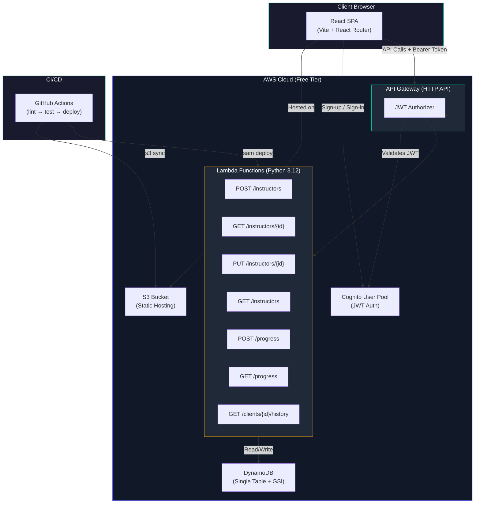

# LiftLink

> A two-sided fitness marketplace connecting instructors with clients — built serverless on AWS Free Tier.

[](https://github.com/AaronMMC/LiftLink)
[](https://aws.amazon.com/free/)
[](LICENSE)

---

## Problem Statement

Finding the right fitness instructor is hard. LiftLink solves this by providing a marketplace where:

- **Instructors** create profiles with their specialty and location, then log workout progress for their clients
- **Clients** search and browse instructors, then view their own progress history with strict data isolation

## Tech Stack

| Layer | Technology |
| --- | --- |
| **IaC** | AWS SAM (`template.yaml`) |
| **Backend** | Python 3.12, AWS Lambda |
| **API** | API Gateway HTTP API |
| **Database** | DynamoDB (single-table, On-Demand) |
| **Auth** | Amazon Cognito (User Pool + JWT authorizer) |
| **Frontend** | React + Vite (static build on S3) |
| **CI/CD** | GitHub Actions |
| **Testing** | pytest + moto (unit), SAM Local (integration) |

## Architecture



> **Key design decisions:** Single-table DynamoDB for zero-cost at rest, HTTP API (not REST API) for lower latency and cost, Cognito JWT authorizer for stateless auth, custom `authz.py` for row-level ownership checks in Lambda code. See [ADRs](docs/adr/) for full reasoning.

## API Endpoints

| Method | Path | Description | Auth |
| --- | --- | --- | --- |
| `POST` | `/instructors` | Create instructor profile | Instructor |
| `GET` | `/instructors/{id}` | Get instructor profile | Any |
| `PUT` | `/instructors/{id}` | Update own profile | Owner |
| `GET` | `/instructors?specialty=X&location=Y` | Search instructors | Any |
| `POST` | `/progress` | Log a progress entry | Instructor |
| `GET` | `/progress` | List own progress entries | Instructor |
| `GET` | `/clients/{id}/history` | View own progress history | Owner |

## Local Development

### Prerequisites

- Python 3.12+
- Node.js 20+
- AWS CLI (`aws --version`)
- AWS SAM CLI (`sam --version`)
- Docker (for DynamoDB Local)

### Backend Setup

```bash
cd backend
python -m venv .venv
source .venv/bin/activate  # Windows: .venv\Scripts\activate
pip install -r requirements.txt

# Run tests
python -m pytest tests/unit/ -v

# Lint
ruff check .
ruff format --check .
```

### Frontend Setup

```bash
cd frontend
npm install
npm run dev      # Development server
npm run build    # Production build
```

### Local API (SAM)

```bash
cd backend
sam build
sam local start-api
```

## Deployment

### Backend

```bash
cd backend
sam build
sam deploy --guided  # First time
sam deploy           # Subsequent
```

### Frontend

```bash
cd frontend
npm run build
aws s3 sync dist/ s3://YOUR_BUCKET_NAME --delete
```

## Testing

```bash
# Unit tests (moto mocks for DynamoDB + Cognito)
cd backend
python -m pytest tests/unit/ -v --tb=short

# Integration tests (multi-handler flows, end-to-end sequences)
python -m pytest tests/integration/ -v --tb=short

# Full test suite
python -m pytest tests/ -v --tb=short
```

### Authorization Hardening

The test suite includes **adversarial authorization tests** that validate the critical data isolation boundary:

- Client A creates progress entries → Client A can read their own history ✅
- Client B attempts to read Client A's history → **403 Forbidden** ✅
- Non-owner instructor attempts to update another instructor's profile → **403 Forbidden** ✅

## Project Structure

```text
LiftLink/
├── backend/
│   ├── template.yaml          # SAM infrastructure
│   ├── src/handlers/
│   │   ├── instructors/       # Instructor CRUD
│   │   ├── clients/           # Client history
│   │   ├── progress/          # Progress entries
│   │   └── shared/            # authz, db, responses
│   ├── tests/                 # Unit + integration
│   └── events/                # Sample API events
├── frontend/                  # React + Vite
├── docs/adr/                  # Architecture decisions
└── .github/workflows/         # CI/CD pipelines
```

## Architecture Decision Records

- [ADR-0001: SAM over CDK](docs/adr/0001-sam-over-cdk.md)
- [ADR-0002: Single-table DynamoDB design](docs/adr/0002-single-table-design.md)
- [ADR-0003: HTTP API over REST API](docs/adr/0003-http-api-over-rest-api.md)

## License

[MIT](LICENSE)  2026 LiftLink Contributors
